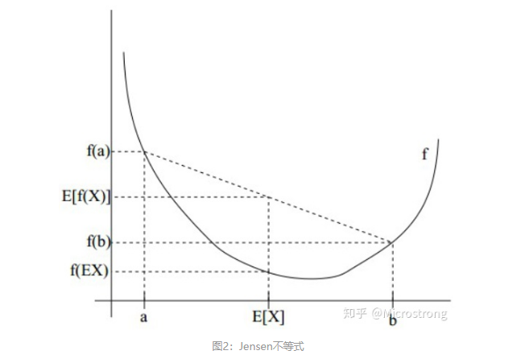

## 简介

EM（Expectation-Maximum）算法是一种迭代优化策略。它的计算方法中每一次迭代都分两步，其中一个为期望步（E步），另一个为极大步（M步），所以也称为期望最大化算法。

其基本思想是：首先根据已经给出的观测数据，估计出模型参数的值；然后再根据上一步估计出的参数值估计缺失数据的值，再根据估计出的缺失数据加上之前已经观测到的数据重新再对参数值进行估计，然后反复迭代，直至最后收敛，迭代结束。

## 预备知识

### [极大似然估计]((https://www.zhihu.com/question/54082000))

用来估计模型参数的统计学方法。定义为：给定联合样本值$x$下关于（未知）参数$\theta$的函数$L(\theta|x)=f(x|\theta)$。这里$f(x|\theta)$是一个密度函数，它表示给定$\theta$下关于联合样本值$x$的联合密度函数。

概率和似然关系：概率（密度）表达给定$\theta$下样本随机向量$X=x$的可能性，而似然表达了给定样本$X=x$下参数$\theta_1$（相比于另外的参数$\theta_2$）为真实值的可能性。我们总是对随机变量的取值谈概率，而在非贝叶斯统计的角度下，参数是一个实数而非随机变量，所以一般不谈一个参数的概率，而称为似然。

一般情况下，我们是根据已知条件来推算结果，而极大似然估计是已知结果，寻求使得该结果出现的可能性最大的条件，以此作为估计值。

* Jensen不等式：

如果f是凸函数，X是随机变量，那么：$E[f(X)]\geqslant f(E[X])$。当且仅当$X$是常量时，该不等式取等号。示例如下：

# 参考文献

[1] [似然函数-知乎](https://www.zhihu.com/question/54082000)

[1] [EM算法详解-知乎](https://zhuanlan.zhihu.com/p/40991784)